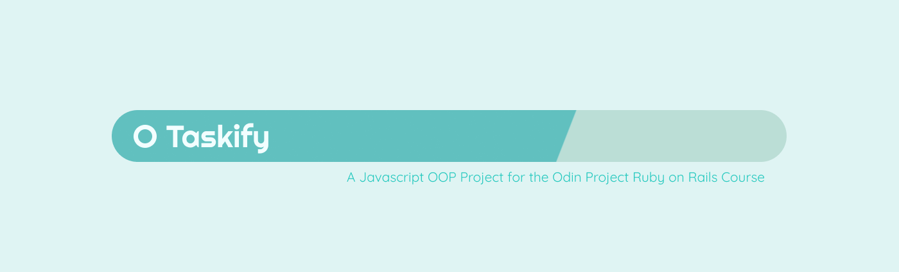
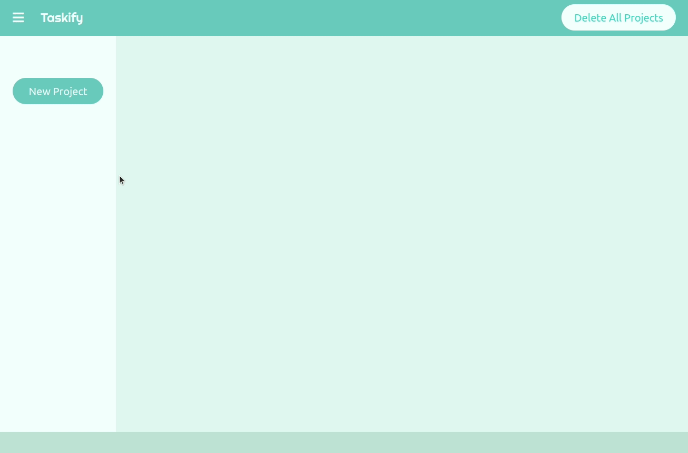

# To Do List Project
A task manager website created for [the Odin Project Ruby on Rails Course](https://www.theodinproject.com/courses/javascript/lessons/todo-list). 

## Features 
The user can first create Projects, and once they are created, the user can select them in the sidebar menu. Upon selection, the Project will show up in the main body and it can be expanded to see additional details about the project including a list of tasks, if there are any, and the description for the Project. Users can update the Project Name and Description as they wish. Tasks can be added to each project. When adding tasks, the user specifies the name, an optional description, and an optional due date. The tasks are then listed by soonest to latest. Tasks can be checked off, and the user can see the progress of the task completion on the project title area. Tasks can be editted and deleted as desired. All data is persistantly stored in Local Storage, but if the user wants to clear their local storage, they can click on the Delete All Projects button and it was remove all objects from their local storage. 

## Demo 

Check out the live version [here](https://zxum.github.io/to-do-list/)

## Reflections
At this point, I have so many ideas I want to implement into each website that I know I'll exceed my allocated project time. I set myself a 3 day turnaround timeframe, as if I was working with a real project timeline. The first day I prepped my project, picking out a color scheme, fonts, and laying out the design in Figma. Then I mocked up the static version of the website on the same day, leaving me two days to finish the Javascript portion. On the second day, I began implementing features based on the structure of the website, focusing on the Navbar and the Sidebar. By the end of the third day, I had gotten all the main features of the project details complete! I was feeling great at this point, and told myself I'll quickly finish the bugs in the morning and start my next project in the afternoon. 

Then I ran into an unlikely roadblock! I couldn't get the date to display properly, and none of the methods from the date-fns module worked! I went through each line of code, debugging and testing. I found the culprit. The date input from my html was recorded as UTC/GMT but then javascript was converting it to my local timezone, giving me a date that's one day before my selected time. Now that I knew what the issue was, I went searching for a solution. I found several work arounds in javascript that had to do with adding the extra bit of time to make up the difference. I felt that there should be a simpler solution and there was! I added an extra string 'T00:00' to manually add a time attribute to the string which meant timezone was also saved. Then I parse the Date object to get a timestamp so I could use the date-fns module! Problem solved! 

One aspect I'm really proud of is how I converted the Project Title area to progress bar. I used a combination of Javascript and css styling to achieve the effect. By calculating the amount of completed tasks versus total tasks, I got a percent. Knowing that linear gradient create a sharp line if the two colors transition at the same location, I interpolated the percent into the linear gradient methods, then added it as a background style to the div. So on each render, the percent changes! Voila, you can make anything into a progress bar! 